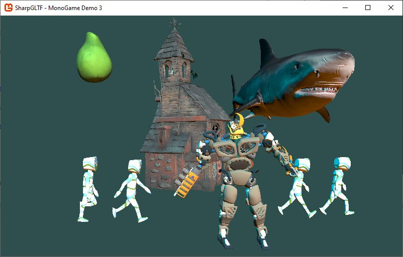

# MonoGame realtime rendering demo

### Overview

This is an example of loading and rendering glTF files with MonoGame.

This demo was originally intended to be an example of how to use SharpGLTF to load glTF models into MonoGame, since then, it has evolved into a full graphics library that helps loading and rendering PBR Animated models into monogame.

The main features of the project, compared with in-built 3D features of MonoGame are:

- Loading glTF models at runtime, without any pipeline processing.
- PBR materials support
- Animated models, out of the box.

### Architecture:

The project is split into 4 different packages that can be used independently.

Notice that the package names and namespaces are **temporary** and subject to change.

- MonoGame.Framework.Graphics.EffectsPBR
- MonoGame.Framework.Graphics.Model3D
- MonoGame.Framework.Graphics.Scene3D
- MonoGame.Framework.Pipeline.GLTF

##### Graphics.EffectsPBR

Defines glTF compatible, PBR effects:

- AnimatedEffect (abstract base class)
  - UnlitEffect
  - PBREffect (abstract)
    - PBRMetallicRoughnessEffect
    - PBRSpecularGlossinessEffect

These effects can be used on their own, and dont' require anything from the rest of libraries.

##### Graphics.Model3D

Defines a number of classes to represent 3D models, using a new architecture that can handle
animated models in a modern way.

##### Graphics.Scene3D

This is a package that can be optinally used, and simplifies drawing scenes with multiple objects.

##### Pipeline.GLTF

This library depends on [SharpGLTF.Core](https://www.nuget.org/packages/SharpGLTF.Core) and loads
glTF models and converts them to the structures defined in Graphics.Model3D.

When loading the models, it is recomended to use EffectsPBR effects, because that would give
the visual results expected by glTF, but it's also possible to fall back to BasicEffect and
SkinnedEffect, in which case the loader will do a "best effort" to convert the materials from
PBR to classic diffuse-specular materials.

### Limitations

##### Pipeline

Right now, It is **not possible** to load glTFs through the content pipeline, glTFs need to be loaded
at runtime, so only projects able to consume Pipeline.GLTF library will be able to load glTFs.

##### Animations

- Due to limitations in the rendering API of MonoGame, glTF's morphing features are not supported.
- Maximum number of bones is limited to 72 bones with SkinnedEffect (as usual) and 128 bones with PBR effects.

##### Textures

Textures are loaded using Monogame's Texture2D.FromStream, which means all of its limitations apply:
- No Mipmaps
- glTF texture formats WEBP and Universal Basis KTX2 can't be loaded.
